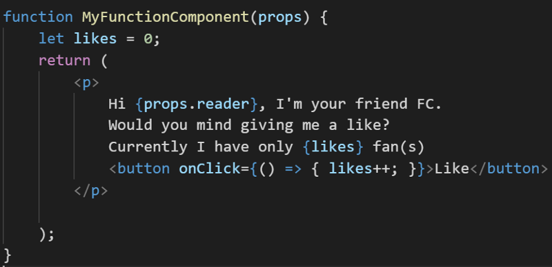

On these episodes, I will try to guide you through a story that will help you understand React Class/Function Components. If you're an experienced React developer this might not be that interesting for you, but I hope you find this enjoyable.

# In the beginning, there was a mother
Once upon a time, there was a really cool javascript library called Reactjs. The reason why it was so cool relied on the fact that developers were able to adapt to it in a quick fashion.

It was a matter of understanding the concept of Component:

> Components let you split the UI into independent, reusable pieces, and think about each piece in isolation.
> https://reactjs.org/docs/components-and-props.html
They did that possible by using something called JSX.

That black magic around javascript code let you write something like:
<Avatar username={username} avatarUrl={avatarUrl} />
And inside that Avatar component you were able to render any HTML or more components using JSX. How did React do such a thing? Well, [black magic](https://reactjs.org/docs/introducing-jsx.html).

## The two sons of Reactjs: Function and Class components
Reactjs gave birth to two guys: the **Function component** and the **Class component**. And a continuos fight between both immediately started. Their mother was always reviewing their job. She taught them [the art of rendering](https://reactjs.org/docs/rendering-elements.html). Which was all about producing HTML by implementing the ["virtual DOM" pattern](https://reactjs.org/docs/faq-internals.html#what-is-the-virtual-dom).

She gave them some rules about this art, which we will be discovering through the story.

Function Component *was the easy to deal with* guy. He wasn't very complex or heavy, he was as simple as a javascript function. And that's why some developers really loved him. Playing with Function Component was as easy as:


He was able to take some props  as a function parameter so that the developer could do anything with it.

His brother Class component was also cool, but he was a little more complex. He was able to do the same job his simple brother could do. Playing with that guy looked something like:


## The origin of the fight
*FC* had a problem: he was able to produce new results whenever someone asked for it, but he wasn't able to react to changes himself 😥.

He wasn't able to detect changes and her mother told them that [they weren't allowed to make changes on their](https://reactjs.org/docs/components-and-props.html#props-are-read-only) ```props```. Their mother was pretty pure on that.

He tried to learn to react to changes with some tricks like having an internal variable and changing it but that didn't make a change. His mother didn't like that and simply **ignored him**. So, even with something like:



He wasn't able to get any fans, his mother was not happy with it and told him he should know his limitations. 

On the other hand, his brother learned to deal with changes.

To be continued...